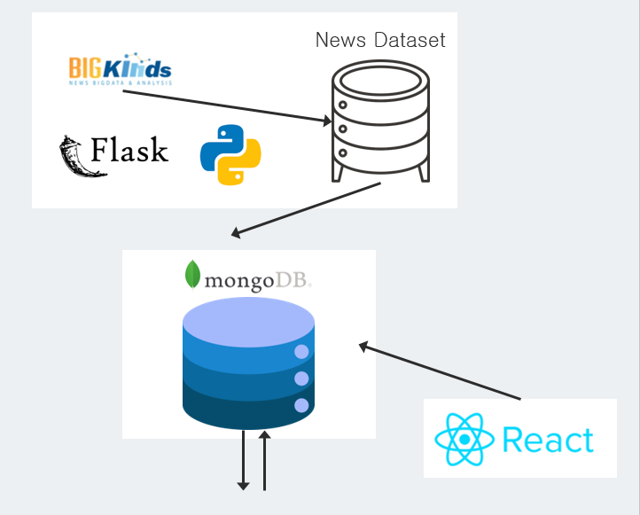

<h1 align="center"> 두뇌 퍼즐 </h1>

## 📝 목차

[프로젝트 개요](#item-one)

[기술 스택](#item-three)

[서버 아키텍처](#item-four)

[서비스 구현 화면](#item-five)

[팀원 소개](#item-two)

[느낀 점](#item-end)

## 📖 프로젝트 개요

<a name="item-one"></a>

<div>

<strong>진행 기간 </strong>: 2023.11.17 ~ 2023.11.22

<strong>목표</strong>

- 일상 생활 속에서 노년층이 치매를 예방하도록 서비스를 제공하는 뉴스 플랫폼

- 개인의 관심 키워드로 뉴스 추천

- 뉴스 내용을 기반으로 AI를 통해 문제 생성

- 퀴즈 결과를 CERAD-K 지표와 연결하여 치매 위험도 분석

</div>

<br/>

## 🛠️ 기술 스택

<a name="item-three"></a>

## 💻 IDE


<br/>

## 📱 Frontend


<br/>

## 💾 Backend


<br/>

## 🔃 DevOPS


<br/>

## ⚙️ Architecture

<a name="item-four"></a>



<br/>

## 🗂️ 프로젝트 파일 구조

<a name="item-five"></a>

<details>
<summary>FrontEnd</summary>

```
📦src
 ┣ 📂assets
 ┃ ┣ 📜art.png
 ┃ ┣ 📜bird.png
 ┃ ┣ 📜ear.png
 ┃ ┣ 📜hand.png
 ┃ ┣ 📜logo.png
 ┃ ┣ 📜main1.png
 ┃ ┣ 📜main2.png
 ┃ ┣ 📜main3.png
 ┃ ┣ 📜main4.png
 ┃ ┗ 📜path.jpg
 ┣ 📂components
 ┃ ┣ 📂quiz
 ┃ ┃ ┣ 📜J1.tsx
 ┃ ┃ ┣ 📜J2.tsx
 ┃ ┃ ┣ 📜J3.tsx
 ┃ ┃ ┣ 📜J4.tsx
 ┃ ┃ ┣ 📜J5.tsx
 ┃ ┃ ┣ 📜J6.tsx
 ┃ ┃ ┣ 📜J7.tsx
 ┃ ┃ ┣ 📜J8.tsx
 ┃ ┃ ┣ 📜J9.tsx
 ┃ ┃ ┣ 📜QuizStep.css
 ┃ ┃ ┗ 📜QuizStep.tsx
 ┃ ┣ 📂ui
 ┃ ┃ ┣ 📜backBtn.tsx
 ┃ ┃ ┣ 📜categoryBtn.tsx
 ┃ ┃ ┗ 📜titleBtn.tsx
 ┃ ┗ 📜Graph.tsx
 ┣ 📂pages
 ┃ ┣ 📜ListenNewsPage.tsx
 ┃ ┣ 📜ListenNewspaper.tsx
 ┃ ┣ 📜MainPage.tsx
 ┃ ┣ 📜ProfilePage.tsx
 ┃ ┣ 📜QuizPage.tsx
 ┃ ┣ 📜ReadNewsPage.tsx
 ┃ ┗ 📜ReadNewspaper.tsx
 ┣ 📂types
 ┃ ┗ 📜index.ts
 ┣ 📂utiles
 ┃ ┣ 📜api.ts
 ┃ ┗ 📜news.ts
 ┣ 📜App.css
 ┣ 📜App.test.tsx
 ┣ 📜App.tsx
 ┣ 📜index.css
 ┣ 📜index.tsx
 ┣ 📜react-app-env.d.ts
 ┣ 📜reportWebVitals.ts
 ┗ 📜setupTests.ts
```

</details>

<details>
<summary>Backend</summary>

```
📦back
 ┣ 📂tokenizer
 ┃ ┣ 📜merges.txt
 ┃ ┗ 📜vocab.json
 ┣ 📜.gitignore
 ┣ 📜app.py
 ┣ 📜category.json
 ┣ 📜clusters.py
 ┣ 📜db.py
 ┣ 📜dict.txt
 ┣ 📜models.py
 ┣ 📜question_generator.py
 ┣ 📜requirements.txt
 ┣ 📜score.py
 ┗ 📜tf-idf.py
```

</details>

<br/>

## 🖥️ 서비스 구현 화면

<a name="item-six"></a>

<br/>

## 👥 팀원 소개

<a name="item-two"></a>

| **Name**     | 김동현                                       | 윤자현                                     | 이상훈                                  | 최상익                                  |
|:------------:|:-----------------------------------------:|:---------------------------------------:|:------------------------------------:|:------------------------------------:|
| **Profile**  |                                           |                                         |                                      |                                      |
| **Position** | BE<br/>FE                                 | 팀장<br/>FE                               | BE<br/>DB                            | BE<br/>FE                            |
| **Position** | 뉴스 추천 알고리즘 구현<br/>치매위험도 페이지 작성            | 메인 페이지 작성<br/><br/>뉴스 페이지 작성<br/>UX/UI  | 치매확률도 계산 구현<br/>RestApi 작성<br/>DB 관리 | AI로 퀴즈 생성 구현<br/>퀴즈 페이지 작성           |
| **Git**      | [GitHub](https://github.com/dongdongx2x2) | [GitHub](https://github.com/YOONJAHYUN) | [GitHub](https://github.com/iri95)   | [GitHub](https://github.com/csi9876) |

<br/>
